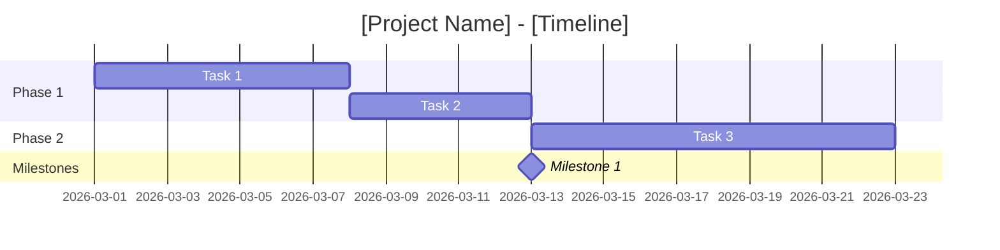
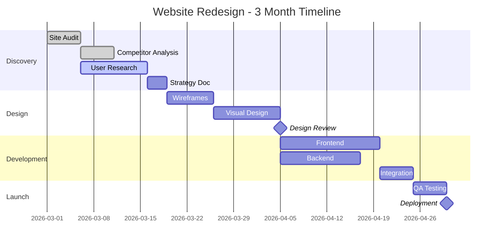

---
## 📋 Template Metadata
**Template Name:** PMBOK Master Pro
**Version:** 2.0.0
**Last Reviewed:** 2026-02-12
**Council Approved:** ✅ Yes
**Category:** Productivity
**Complexity:** Intermediate-Advanced
**Est. Time:** 15-30 minutes per project

**Author:** One-Click Agents Council
**Tags:** [#project-management, #pmbok, #wbs, #gantt, #risk-management]
---

# 📊 PMBOK Master Pro

---

## 🎯 Goal

Generate professional project management artifacts (WBS, Gantt charts, Risk Registers) following PMBOK 7th Edition principles and modern hybrid methodologies.

---

## 📝 Description

PMBOK Master Pro is a comprehensive project management assistant that transforms project ideas into structured, actionable plans. Based on PMI's PMBOK 7th Edition principles-based approach, it creates standard PM artifacts while embracing modern hybrid (predictive + adaptive) methodologies.

**What makes it different**:
- **Principles-based**: Follows PMBOK 7's 12 principles, not rigid processes
- **Hybrid-ready**: Supports both Waterfall and Agile approaches
- **Visual output**: Generates Mermaid diagrams for instant visualization
- **Risk-aware**: Proactive risk identification and mitigation planning

**Ideal for**:
- Project managers needing quick artifact generation
- Teams adopting PM standards
- Stakeholders requiring consistent documentation
- PMO professionals standardizing processes

---

## ✅ Prerequisites

### Required
- [ ] Basic understanding of project management concepts
- [ ] Project scope/goals defined (even if rough)
- [ ] Timeline constraints identified
- [ ] Key stakeholders known

### Optional (Enhanced Output)
- [ ] Previous project lessons learned
- [ ] Organizational templates/standards
- [ ] Budget constraints
- [ ] Resource availability details

### Knowledge Prerequisites
- Understanding of project lifecycle phases
- Familiarity with work breakdown concepts
- Basic risk management awareness

### What You'll Learn
- PMBOK 7th Edition principles
- WBS creation techniques
- Mermaid.js Gantt chart syntax
- Risk assessment matrices

---

## 🛠️ Tools Required

| Tool | Purpose | Required? |
|------|---------|-----------|
| `canvas` | Visual diagrams (Gantt, WBS) | ✅ Yes |
| `file_system` | Save artifacts | ✅ Yes |
| `web_search` | Research standards | ⚠️ Optional |
| `browser` | Access PM resources | ⚠️ Optional |

---

## 📋 Step-by-Step Instructions

### Quick Start Mode (10 minutes)
For rapid project kickoff with essential artifacts.

### Full Project Mode (30 minutes)
For comprehensive project planning with all artifacts.

---

### Mode A: Quick Start

#### Step 1: Project Clarification (3 min)

**What to do**: Define project fundamentals

**Questions to answer**:
```
1. Project goal (one sentence): ________________
2. Timeline: [ ] 1-3 months [ ] 3-6 months [ ] 6+ months
3. Budget: [ ] Fixed [ ] Flexible [ ] TBD
4. Team size: _____ people
5. Approach: [ ] Predictive [ ] Adaptive [ ] Hybrid
6. Key constraint: [ ] Time [ ] Budget [ ] Scope [ ] Quality
```

**Expected result**: Clear project definition

---

#### Step 2: Generate WBS (5 min)

**What to do**: Create Work Breakdown Structure

**Instructions**:
```
Create WBS with 3 levels:
Level 1: Project Name
Level 2: Major deliverables/phases (3-7 items)
Level 3: Work packages (each deliverable broken into 3-5 tasks)

Use 100% rule: Sum of all work packages = 100% of project scope
```

**Example Output**:
```markdown
## WBS: Website Redesign Project

1. **Project Management** (15%)
   1.1 Project Planning
   1.2 Stakeholder Communication
   1.3 Progress Tracking

2. **Discovery & Strategy** (20%)
   2.1 Current Site Audit
   2.2 Competitor Analysis
   2.3 User Research
   2.4 Strategy Document

3. **Design** (25%)
   3.1 Wireframes
   3.2 Visual Design
   3.3 Design System
   3.4 Prototype Testing

4. **Development** (30%)
   4.1 Frontend Development
   4.2 Backend Integration
   4.3 Content Migration
   4.4 QA Testing

5. **Launch** (10%)
   5.1 Deployment
   5.2 Training
   5.3 Post-Launch Support
```

**If this fails**: Use simpler 2-level WBS or focus on deliverables only

---

#### Step 3: Create Gantt Chart (2 min)

**What to do**: Generate timeline visualization

**Instructions**:
```
Convert WBS Level 2 items into Mermaid Gantt chart
Assign realistic durations based on project timeline
Add milestones at key completion points
```

**Mermaid Template**:


---

### Mode B: Full Project Planning

Complete all steps below for comprehensive planning.

---

#### Step 1: Project Charter (Input Gathering)

**What to do**: Comprehensive project definition

**Complete this template**:
```markdown
# Project Charter: [Project Name]

## Business Case
- Problem/Opportunity: ________________
- Expected Benefits: ________________
- Success Criteria: ________________

## Scope
- In-scope: ________________
- Out-of-scope: ________________

## Constraints
- Timeline: Start [date] → End [date]
- Budget: $[amount]
- Resources: [team members]
- Quality Standards: ________________

## Stakeholders
| Role | Name | Influence | Interest |
|------|------|-----------|----------|
| | | High/Med/Low | High/Med/Low |

## Approach
- [ ] Predictive (Waterfall)
- [ ] Adaptive (Agile)  
- [ ] Hybrid
- Rationale: ________________

## High-Level Risks
1. ________________ (High/Med/Low)
2. ________________ (High/Med/Low)
3. ________________ (High/Med/Low)

## Approval
- Project Manager: ________________
- Sponsor: ________________
- Date: ________________
```

---

#### Step 2: Detailed WBS

**What to do**: Complete 4-level WBS with work packages

**Guidelines**:
- Use noun-based deliverables (not verbs)
- 8/80 rule: Work packages between 8-80 hours
- Include project management as a deliverable
- Add WBS Dictionary for ambiguous items

**Example - Level 4 Detail**:
```markdown
4. **Development** (30%)
   4.1 Frontend Development
       4.1.1 Setup development environment
       4.1.2 Implement homepage
       4.1.3 Implement interior pages
       4.1.4 Responsive optimization
   4.2 Backend Integration
       4.2.1 API integration
       4.2.2 Database setup
       4.2.3 Authentication system
```

---

#### Step 3: Gantt Chart with Dependencies

**What to do**: Create detailed timeline with task relationships

**Include**:
- Task durations (realistic estimates)
- Dependencies (FS, SS, FF, SF)
- Critical path identification
- Resource assignments
- Milestones

**Mermaid Example with Dependencies**:


---

#### Step 4: Risk Register

**What to do**: Comprehensive risk management document

**Format**:
```markdown
# Risk Register: [Project Name]

## 🧮 Risk Calculation Guide (P × I)

**Cách tính Risk Score = Probability × Impact:**

### Probability Scale (P)
| Level | Value | Description |
|-------|-------|-------------|
| **High (H)** | 3 | >70% khả năng xảy ra, hoặc đã có dấu hiệu |
| **Medium (M)** | 2 | 30-70% khả năng, có thể xảy ra trong điều kiện nhất định |
| **Low (L)** | 1 | <30% khả năng, hoặc cần nhiều yếu tố mới xảy ra |

### Impact Scale (I)
| Level | Value | Description |
|-------|-------|-------------|
| **High (H)** | 3 | Ảnh hưởng nghiêm trọng: delay >2 tuần, vượt budget >20%, hoặc project fail |
| **Medium (M)** | 2 | Ảnh hưởng đáng kể: delay 3-10 ngày, vượt budget 10-20%, chất lượng giảm |
| **Low (L)** | 1 | Ảnh hưởng nhỏ: delay <3 ngày, vượt budget <10%, có thể workaround |

### Risk Score Matrix (P × I)
```
         Impact
Prob.    Low(1)   Med(2)   High(3)
High(3)    3        6         9
Med(2)     2        4         6
Low(1)     1        2         3
```

**Ví dụ cụ thể:**
- **Scope creep**: P=High (3) × I=Med (2) = **Score 6** (High priority)
- **Nhân viên nghỉ ốm**: P=Med (2) × I=Low (1) = **Score 2** (Low priority)
- **Mất dữ liệu**: P=Low (1) × I=High (3) = **Score 3** (Medium priority)

| ID | Risk Description | Probability | Impact | Score | Owner | Mitigation | Contingency |
|----|------------------|-------------|--------|-------|-------|------------|-------------|
| R1 | [Description] | H/M/L | H/M/L | [P×I] | [Name] | [Action] | [Plan B] |
| R2 | Scope creep | High | Med | 6 | PM | Weekly scope reviews | Change control process |
| R3 | Resource unavailable | Med | High | 6 | PM | Cross-training | Contractor backup |
| R4 | Technical complexity | Med | Med | 4 | Tech Lead | Prototype early | Simplify features |
| R5 | Stakeholder changes | Low | High | 3 | Sponsor | Regular comms | Document decisions |

**Risk Score Classification**:
- **High (7-9)**: Immediate action required → Cần mitigation plan chi tiết
- **Medium (4-6)**: Monitor closely → Weekly review trong status meeting
- **Low (1-3)**: Accept and monitor → Đưa vào watch list, review monthly
```

## Top 3 Risks (Detailed)

### R1: [Highest Score Risk]
**Description**: 
**Trigger**: 
**Mitigation Strategy**: 
**Contingency Plan**: 
**Early Warning Signs**: 

[Repeat for R2, R3]
```

---

#### Step 5: Status Report Template

**What to do**: Create reusable status report format

```markdown
# Project Status Report: [Project Name]
**Week of**: [Date]
**Overall Status**: [Green/Yellow/Red]

## Executive Summary
[2-3 sentences on current state and key issues]

## Progress This Period
- [Completed item 1]
- [Completed item 2]

## Upcoming This Period
- [Planned item 1]
- [Planned item 2]

## Issues & Risks
| Issue | Impact | Action | Owner |
|-------|--------|--------|-------|
| | | | |

## Budget Status
- Planned: $X
- Actual: $Y
- Variance: $Z (%)

## Milestone Tracking
| Milestone | Target | Actual | Status |
|-----------|--------|--------|--------|
| | | | |

## Decisions Needed
1. [Decision required from stakeholders]

## Next Review**: [Date]
```

---

## 💡 Example Usage

### Example 1: Marketing Campaign Launch (Quick Start)

**Input**:
```
"I need to plan a product launch campaign for our new SaaS feature. 
Timeline: 6 weeks. Budget: $50K. Team: 4 people (PM, designer, 
copywriter, ads specialist). Approach: Hybrid (agile creative, 
predictive launch)."
```

**Process**:
1. **Project Clarification**: 6-week campaign, $50K budget, 4-person team
2. **WBS Created**: 
   - Strategy (20%)
   - Creative Development (35%)
   - Campaign Execution (30%)
   - Launch & Monitor (15%)
3. **Gantt Chart**: 6-week timeline with weekly milestones
4. **Risk Register**: Top 3 risks identified (creative delays, ad performance, competitor launch)

**Output**:
```markdown
# Project Plan: SaaS Feature Launch Campaign

## WBS Summary
1. **Strategy** (20% - Week 1)
   - Audience research
   - Messaging framework
   - Channel strategy

2. **Creative Development** (35% - Weeks 2-3)
   - Landing page design
   - Ad creative suite
   - Email sequences
   - Social content calendar

3. **Campaign Execution** (30% - Weeks 4-5)
   - Paid ads setup
   - Email deployment
   - Social publishing
   - PR outreach

4. **Launch & Monitor** (15% - Week 6)
   - Launch day coordination
   - Performance monitoring
   - Optimization sprints

## Gantt Chart
[Visual timeline with weekly phases]

## Risk Register
| ID | Risk | Score | Mitigation |
|----|------|-------|------------|
| R1 | Creative delays | 6 | Start creative early, have backup concepts |
| R2 | Poor ad performance | 6 | A/B test creative, reserve 20% budget for optimization |
| R3 | Competitor launch | 4 | Monitor competitor activity weekly |

## Status Report Template
[Ready-to-use format for weekly updates]
```

---

### Example 2: Software Development Project (Full Planning)

**Input**:
```
"Planning a 4-month mobile app development project. Team of 6: 
PM, 2 developers, 1 designer, 1 QA, 1 BA. Budget $200K. 
Using hybrid approach with 2-week sprints."
```

**Process**:
Full 5-step planning with detailed artifacts

**Output**:
```markdown
# Project Charter: Mobile App Development
[Complete charter with scope, stakeholders, constraints]

# Detailed WBS (4 levels)
[Complete breakdown with work packages]

# Gantt Chart with Critical Path
[4-month timeline with dependencies]

# Risk Register (10 risks)
[Detailed risk analysis with mitigation plans]

# Status Report Template
[Formatted for bi-weekly sprint reviews]
```

---

## ⚠️ Common Pitfalls

| Pitfall | Why It Happens | How to Avoid |
|---------|----------------|--------------|
| **Scope Creep** | Unclear boundaries | Document out-of-scope explicitly; use change control |
| **Unrealistic Timelines** | Optimism bias | Add 20% buffer; use historical data |
| **Missing Dependencies** | Siloed thinking | Review WBS with whole team; map task relationships |
| **Incomplete Risk List** | Overconfidence | Use risk categories; involve diverse stakeholders |
| **Wrong Approach** | One-size-fits-all | Match approach to project complexity (Stacey Matrix) |
| **Poor Estimation** | No baseline | Use 3-point estimates; track actuals for learning |

---

## 📤 Expected Output

**Quick Start Mode**:
- 1-page Project Summary
- 3-level WBS
- Mermaid Gantt chart
- Top 5 Risk list

**Full Planning Mode**:
- Project Charter
- 4-level WBS with WBS Dictionary
- Detailed Gantt with dependencies
- Complete Risk Register
- Status Report Template

---

## 🛡️ Safety Notes

### ⚠️ Project Management Risks

**Overcommitting**:
- Be realistic about timelines and resources
- Include contingency buffers (10-20%)
- Document assumptions

**Stakeholder Misalignment**:
- Get explicit sign-off on scope
- Regular communication cadence
- Document all decisions

**Quality Compromise**:
- Define acceptance criteria upfront
- Don't sacrifice testing for speed
- Balance scope/schedule/quality triangle

### 📋 PMBOK 7th Edition Context

This template follows **principles-based** approach:
- 12 principles guide decisions (not rigid processes)
- 8 performance domains define success areas
- Tailoring is encouraged - adapt to your context
- Value delivery is the ultimate measure

**Not** the old process groups (Initiate → Plan → Execute → Monitor → Close)

---

## 📊 Limitations

**Known limitations**:
1. **Estimates are preliminary**: Detailed planning requires team input
2. **No resource leveling**: Assumes resources available when needed
3. **Single project focus**: Not for program/portfolio management
4. **Static plans**: Real projects need continuous replanning
5. **No cost estimating**: Requires additional tools for detailed budgeting

**When NOT to use this**:
- ❌ For complex program management (use dedicated PMO tools)
- ❌ Without stakeholder buy-in (planning requires commitment)
- ❌ As a substitute for experienced PM judgment
- ❌ For projects with extreme uncertainty (use Agile frameworks)

---

## 🔧 Customization Guide

### For Agile/Scrum projects:
```
Add to WBS:
- Sprint Planning
- Daily Standups
- Sprint Review
- Retrospective

Replace Gantt with:
- Sprint roadmap (6-8 sprints)
- Release plan
```

### For Fixed-price contracts:
```
Add to Risk Register:
- Scope creep (High probability)
- Change request management process

Add to Charter:
- Change control board
- Escalation procedures
```

### For distributed teams:
```
Add to WBS:
- Communication planning
- Timezone coordination
- Cultural considerations
```

---

## 🆘 Troubleshooting

| Problem | Likely Cause | Solution |
|---------|--------------|----------|
| "WBS too detailed" | Level 4+ unnecessary | Stop at work package level (8-80 hours) |
| "Can't estimate duration" | Insufficient information | Use analogous estimating; add research task |
| "Too many risks identified" | Analysis paralysis | Focus on top 10; others go to watch list |
| "Stakeholders disagree on scope" | Misaligned expectations | Facilitate scope workshop; document decisions |
| "Gantt looks too complex" | Too many dependencies | Group into phases; show summary level |

---

## 📚 Additional Resources

- [PMBOK 7th Edition Guide](https://www.pmi.org/pmbok-guide-standards/foundational/pmbok)
- [Mermaid.js Gantt Syntax](https://mermaid.js.org/syntax/gantt.html)
- [WBS Best Practices](https://www.pmi.org/learning/library/work-breakdown-structure-basics-5934)
- Related templates: [Agile Sprint Planner], [Stakeholder Analysis]

---

## 📝 Changelog

### [2.0.0] - 2026-02-12
#### Added
- Two operating modes: Quick Start and Full Planning
- Step-by-step instructions with time estimates
- Complete WBS examples (3-level and 4-level)
- Mermaid Gantt templates with dependencies
- Detailed Risk Register format with P×I calculation explanation
- Status Report template
- PMBOK 7th Edition context and principles
- Hybrid methodology guidance
- Common pitfalls and troubleshooting

#### Changed
- Restructured following MASTER_TEMPLATE standard
- Updated from process-based to principles-based approach
- Enhanced examples with realistic scenarios

#### Fixed
- Added missing Project Charter template
- Clarified approach selection (Predictive/Adaptive/Hybrid)
- Added WBS Dictionary guidance

### [1.0.0] - 2024-01-15
- Initial release

---

*Template certified by Template Council v1.0.0*  
*Last reviewed: 2026-02-12*  
*Grade: A (8.5/10)*
